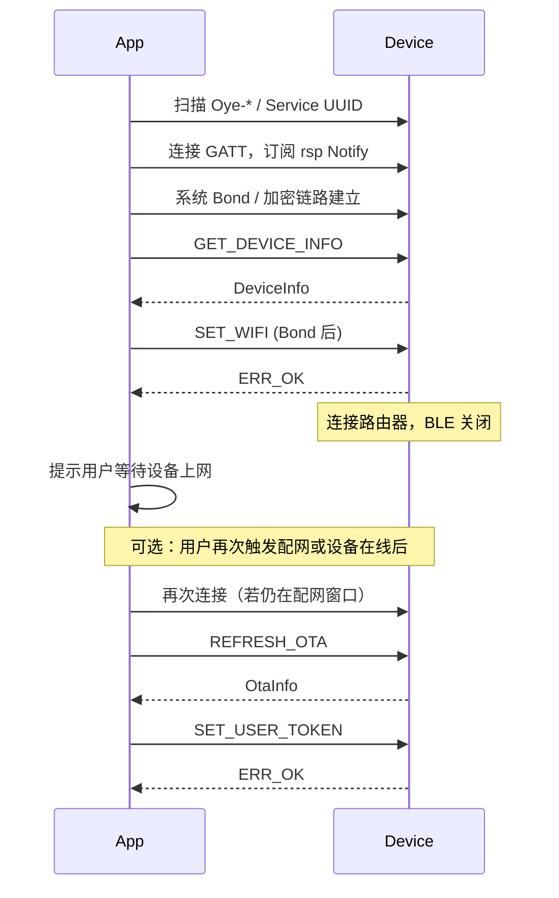

# Oye 设备 BLE 配网 — 手机 App 开发指南

本文档面向 **iOS / Android** 客户端工程师，说明如何扫描设备、完成蓝牙配对（Bond）、通过 GATT 收发 **Protobuf** 消息，并完成 Wi‑Fi 配网、OTA 信息查询与用户账号绑定。

固件侧概要文档见 [oye-ble-proto_zh.md](./oye-ble-proto_zh.md)。协议唯一源文件：

- [`proto/oye/device/v1/device.proto`](../proto/oye/device/v1/device.proto)
- [`proto/oye/device/v1/device.options`](../proto/oye/device/v1/device.options)（字符串长度等 nanopb 限制，App 侧应遵守相同上限）

---

## 1. 能力边界（请先读）

| 支持 | 不支持（v1） |
|------|----------------|
| BLE 扫描 / 连接 / Bond | 经 BLE 传输固件包 |
| 下发 Wi‑Fi SSID/密码 | 贴纸等业务数据同步 |
| 读设备信息、OTA 元数据、用户状态 | 与 BluFi / Wi‑Fi Hotspot 同时使用 |
| 写入用户 `access_token` | |

设备在 **Wi‑Fi 连接成功后会主动关闭 BLE**（省电）。配网完成后若还要查 OTA，需等设备再次进入配网模式，或在连网前完成查询。

---

## 2. 发现与连接

### 2.1 何时能扫到设备

- 设备 **无已保存 Wi‑Fi**，或用户主动进入 **配网模式** 时，固件开启 BLE 广播。
- 广播名格式：`Oye-` + MAC 相关后缀（实现取 MAC 字符串末尾，如 `Oye-34fb`）。
- 广播包内含 128-bit Service UUID（见下表），可按 Service UUID 过滤扫描。

### 2.2 GATT 服务与特征

| 角色 | 名称 | UUID | 属性 |
|------|------|------|------|
| Service | Oye Device v1 | `6fa50001-0000-1000-8000-00805f9b34fb` | Primary |
| Characteristic | `cmd` | `6fa50002-0000-1000-8000-00805f9b34fb` | Write、Write Without Response |
| Characteristic | `rsp` | `6fa50003-0000-1000-8000-00805f9b34fb` | Notify |

**数据方向**

- App → 设备：向 `cmd` 写入数据（建议 Write Without Response，按序发多个 Chunk）。
- 设备 → App：订阅 `rsp` 的 Notify，接收响应 Chunk。

### 2.3 连接后必做步骤

1. 连接 GATT。
2. **协商 MTU**（建议请求 247 或 517，视系统支持而定）。
3. 对 `rsp` 开启 **CCCD（Notify 订阅）**。
4. 触发 **配对 / Bond**（见第 3 节）；敏感命令依赖 Bond。
5. 再发送业务 `Envelope`。

空闲 **5 分钟** 无连接活动，设备可能自动停止广播（需重新扫描）。

---

## 3. 配对（Bond）说明

固件启用 **LE Secure Connections + Bonding**（`sm_sc` + `sm_bonding`），IO 能力为 **NoInputNoOutput**（Just Works，无 PIN 码界面）。

### 3.1 App 侧建议

| 平台 | 建议 |
|------|------|
| **Android** | 连接后调用 `createBond()`，或首次访问需加密特征时系统自动弹窗；使用 `TRANSPORT_LE`。 |
| **iOS** | 连接后访问需加密服务或调用 `retrievePeripherals(withIdentifiers:)` 恢复已配对设备；首次连接系统可能弹出「配对」确认。 |

### 3.2 设备何时认为「已 Bond」

固件在收到 **`BLE_GAP_EVENT_ENC_CHANGE` 且成功** 后置 `bonded = true`。此后才允许：

- `CMD_SET_WIFI`（10）
- `CMD_SET_USER_TOKEN`（11）
- `CMD_UNPAIR`（21）

未 Bond 调用上述命令时，响应：

- `error = ERR_NOT_AUTHORIZED`（2）
- `error_message = "bond required"`

只读命令（设备信息 / OTA / 用户状态）**不要求** Bond。

### 3.3 解绑

发送 `CMD_UNPAIR`（需已 Bond）后，设备会：

- 清空 NVS 中 `user` 命名空间；
- 清除 NimBLE bond 记录（`ble_store_clear`）。

App 侧应同时 **删除本地保存的该设备 Bond / 缓存 token**。

---

## 4. 协议分层

```text
┌─────────────────────────────────────┐
│  Chunk（BLE 每包 Write / Notify）    │  ← MTU 受限时的外层分片
├─────────────────────────────────────┤
│  Envelope（请求 / 响应信封）          │  ← schema_version、request_id、cmd
├─────────────────────────────────────┤
│  payload（内层 Protobuf）            │  ← DeviceInfo / SetWifiRequest 等
└─────────────────────────────────────┘
```

- **包名**：`oye.device.v1`
- **schema_version**：固定填 `1`
- **request_id**：App 生成的 uint32，响应中原样带回，用于关联异步 Notify

---

## 5. 分片（Chunk）

单条 BLE 载荷不足以放下整个 `Envelope` 时，必须用 `Chunk` 分包。

### 5.1 Chunk 消息定义

```protobuf
message Chunk {
  uint32 seq = 1;    // 0 .. total-1
  uint32 total = 2;  // 分片总数，至少为 1
  bytes data = 3;    // 本片字节（设备侧 max 512）
}
```

### 5.2 发送规则（App → `cmd`）

1. 将 **完整 `Envelope` 二进制**（Protobuf encode 后）作为逻辑载荷。
2. 按 **每片原始数据 ≤ 180 字节** 切分（与固件 `EncodeChunks` 默认一致；在 MTU 较小时可适当减小）。
3. 对每片构造 `Chunk{ seq, total, data }`，再 **单独 encode 成一个 Chunk 消息**，写入 `cmd` 一次。
4. 必须 **按 `seq` 从 0 到 total-1 顺序** 写入；设备收齐所有片后才解析 Envelope。

### 5.3 接收规则（`rsp` Notify）

1. 每收到一条 Notify，decode 为 `Chunk`。
2. 按 `seq` 缓存，收齐 `total` 片后按序拼接 `data`。
3. 对拼接结果 decode `Envelope`。
4. 用 `request_id` 与发出的请求匹配。

### 5.4 伪代码

```text
function sendCommand(envelope):
    bytes = ProtobufEncode(Envelope, envelope)
    chunks = split(bytes, maxChunkDataSize=180)
    total = len(chunks)
    for seq, part in enumerate(chunks):
        chunk = Chunk(seq=seq, total=total, data=part)
        writeCharacteristic(CMD_UUID, ProtobufEncode(Chunk, chunk))

function onNotify(data):
    chunk = ProtobufDecode(Chunk, data)
    assembler.add(chunk.seq, chunk.data)
    if assembler.complete():
        envelope = ProtobufDecode(Envelope, assembler.join())
        dispatch(envelope)
```

若任一片 `total` 与已缓存不一致，设备会 **丢弃当前组装状态**；App 应超时重发整包请求。

---

## 6. Envelope 与错误码

### 6.1 Envelope

```protobuf
message Envelope {
  uint32 schema_version = 1;  // 固定 1
  uint32 request_id = 2;
  Command cmd = 3;
  bytes payload = 4;          // 请求：内层消息；响应：内层消息或空
  ErrorCode error = 5;        // 仅响应有效，请求填 0
  string error_message = 6;   // 仅响应，max 128 字符
}
```

**响应约定**

- 成功：`error = ERR_OK`（0），业务数据在 `payload` 中（与 `cmd` 同类型的 decode）。
- 失败：`error != ERR_OK`，`error_message` 为人类可读说明，`payload` 通常为空。

### 6.2 Command 枚举

| 值 | 名称 | 需 Bond | 说明 |
|----|------|---------|------|
| 1 | `CMD_GET_DEVICE_INFO` | 否 | 读设备信息 |
| 2 | `CMD_GET_OTA_INFO` | 否 | 读 OTA 缓存快照 |
| 3 | `CMD_GET_USER_INFO` | 否 | 读激活 / Token 状态 |
| 10 | `CMD_SET_WIFI` | **是** | 下发 Wi‑Fi |
| 11 | `CMD_SET_USER_TOKEN` | **是** | 保存 access_token |
| 12 | `CMD_REFRESH_OTA` | 否 | 设备联网时 HTTP 拉 OTA，再返回 OtaInfo |
| 20 | `CMD_START_PAIRING` | 否 | 占位，无额外动作 |
| 21 | `CMD_UNPAIR` | **是** | 解绑 |

### 6.3 ErrorCode 枚举

| 值 | 名称 | 典型场景 |
|----|------|----------|
| 0 | `ERR_OK` | 成功 |
| 1 | `ERR_INVALID_REQUEST` | 非法 cmd、payload 解析失败 |
| 2 | `ERR_NOT_AUTHORIZED` | 未 Bond 调用敏感命令 |
| 3 | `ERR_BUSY` | 预留 |
| 4 | `ERR_NO_NETWORK` | `REFRESH_OTA` 时 Wi‑Fi 未连接 |
| 5 | `ERR_INTERNAL` | 设备内部失败（如 HTTP OTA 失败） |

---

## 7. 各命令 payload 说明

### 7.1 `CMD_GET_DEVICE_INFO` → `DeviceInfo`

| 字段 | 类型 | 最大长度 | 说明 |
|------|------|----------|------|
| `mac` | string | 20 | 如 `aa:bb:cc:dd:ee:ff` |
| `uuid` | string | 40 | 设备软件 UUID |
| `board_name` | string | 64 | 板型名 |
| `fw_version` | string | 32 | 当前固件版本 |
| `chip_model` | string | 32 | 芯片型号 |

请求 `payload` 为空。

### 7.2 `CMD_GET_OTA_INFO` → `OtaInfo`

| 字段 | 类型 | 说明 |
|------|------|------|
| `current_version` | string | 当前运行版本 |
| `has_update` | bool | 是否有新版本 |
| `new_version` | string | 服务器版本号 |
| `firmware_url` | string | HTTP 固件地址（max 256） |
| `last_check_epoch` | int64 | 上次检查 Unix 秒；0 表示从未成功检查 |
| `needs_network` | bool | 固件实现：`last_check_epoch == 0` 时为 true |

数据来自设备本地 **快照**（上次 HTTP `CheckVersion` 或 `REFRESH_OTA`），非实时云端查询。

### 7.3 `CMD_GET_USER_INFO` → `UserInfo`

| 字段 | 类型 | 说明 |
|------|------|------|
| `activated` | bool | `!has_activation_code && has_token` |
| `activation_code` | string | 待输入的激活码（如有） |
| `activation_message` | string | 激活提示文案 |
| `has_token` | bool | NVS 是否已有 `access_token` |

### 7.4 `CMD_SET_WIFI` ← `SetWifiRequest`

| 字段 | 类型 | 最大长度 |
|------|------|----------|
| `ssid` | string | 33 |
| `password` | string | 64 |

成功后设备会：保存 SSID、启动 Station 连接路由器。**数秒内 BLE 可能断开**（连网后固件 `Stop()` BLE）。

### 7.5 `CMD_SET_USER_TOKEN` ← `SetUserTokenRequest`

| 字段 | 类型 | 最大长度 |
|------|------|----------|
| `access_token` | string | 256 |

设备写入 NVS；后续 HTTP OTA 请求会自动加 `Authorization` 头（无空格时自动加 `Bearer ` 前缀）。

### 7.6 `CMD_REFRESH_OTA`

- 请求 `payload` 为空。
- 若 Wi‑Fi **未连接**：`ERR_NO_NETWORK`。
- 若已连接：设备 HTTP `CheckVersion`，成功则响应 `payload` 为 **OtaInfo**（同 GET）。

---

## 8. 推荐业务流程

### 8.1 首次配网（主流程）



### 8.2 步骤清单（给产品 / QA）

1. 打开蓝牙权限，扫描 `Oye-` 前缀或 Service `6fa50001-...`。
2. 连接并订阅 `rsp`。
3. 完成系统配对（Bond）。
4. 发 `GET_DEVICE_INFO`，展示设备型号与版本。
5. 用户选择 Wi‑Fi，发 `SET_WIFI`（ssid/password）。
6. 等待设备上网（BLE 可能已断，属正常）。
7. 若需展示新版本：在设备仍广播时发 `REFRESH_OTA`，或提示用户稍后到「已绑定设备」页再查。
8. 用户登录 App 后，发 `SET_USER_TOKEN` 绑定账号。

### 8.3 `request_id` 建议

- 单调递增或随机 uint32，**每条请求唯一**。
- 收到 Notify 后仅处理 `request_id` 匹配的响应（设备按请求同步回复，一般顺序一致，仍建议校验）。

---

## 9. 生成移动端 Protobuf 代码

仓库根目录执行（需 `protoc` + `nanopb` 或各平台标准 `protoc` 插件）：

```bash
./proto/generate.sh
```

| 平台 | 建议 |
|------|------|
| **Android** | `protobuf-java` 或 `protobuf-kotlin`，自 `device.proto` 生成；Gradle 引用与固件相同 proto 文件。 |
| **iOS** | SwiftProtobuf / `protobuf` Objective-C，将 `device.proto` 加入 Xcode 生成 target。 |

包名保持 `oye.device.v1`，避免与固件字段号不一致。

---

## 10. 平台注意事项

### Android

- 权限：`BLUETOOTH_SCAN`、`BLUETOOTH_CONNECT`（Android 12+），以及定位（若扫描需要）。
- 扫描过滤：`ScanFilter.Builder().setServiceUuid(ParcelUuid.fromString("6fa50001-0000-1000-8000-00805f9b34fb"))`。
- 写入 `cmd` 时注意 **MTU**；`requestMtu(517)` 后再发 Chunk。
- Bond：`device.createBond()`，监听 `ACTION_BOND_STATE_CHANGED`。

### iOS

- `CBCentralManager` 扫描 + `CBPeripheral` 连接。
- Service UUID 过滤：`CBUUID(string: "6FA50001-0000-1000-8000-00805F9B34FB")`（大小写不敏感）。
- 对 `rsp`：`setNotifyValue(true, for: characteristic)`。
- 配对由系统在需要加密时触发；可通过 `CBPeripheral` 的 `ancs` 无关，确保不要跳过配对对话框。

---

## 11. 调试与常见问题

| 现象 | 可能原因 | 处理 |
|------|----------|------|
| 扫不到设备 | 设备已有 Wi‑Fi 且未进配网模式 | 让用户在设备上进入配网 / 清除设备 Wi‑Fi |
| `bond required` | 未 Bond 就发 SET_WIFI | 先配对再发 |
| 发 SET_WIFI 后立刻断连 | 正常，设备去连路由器 | UI 提示「配网中，请稍候」 |
| GET_OTA 全空 / needs_network | 从未 REFRESH 且未联网 | 先 SET_WIFI，再 REFRESH_OTA |
| REFRESH_OTA 失败 | 路由器无外网或 OTA 服务器不可达 | 检查网络与服务器 |
| 收不到响应 | 未订阅 Notify 或 Chunk 丢片 | 检查 CCCD、按序重发 |
| 解绑后旧手机仍能连 | 仅设备端清 bond | App 删除本地配对缓存 |

可用 **nRF Connect** 验证：能否看到 Service/特征、手动 Write `cmd`（需按 Chunk 格式构造二进制）。

---

## 12. 版本与兼容

- 当前协议版本：**v1**（`schema_version = 1`）。
- 新增字段：在 proto 中 **只追加字段号**，旧 App 可忽略新字段。
- 破坏性变更：将发布 `oye.device.v2` 新 Service UUID（届时另文通知）。

---

## 13. 相关文件索引

| 文件 | 说明 |
|------|------|
| [`proto/oye/device/v1/device.proto`](../proto/oye/device/v1/device.proto) | 协议定义 |
| [`main/ble/oye_ble_service.cc`](../main/ble/oye_ble_service.cc) | GATT / 广播 / Bond |
| [`main/ble/oye_ble_codec.cc`](../main/ble/oye_ble_codec.cc) | Chunk 组包 |
| [`main/ble/oye_ble_commands.cc`](../main/ble/oye_ble_commands.cc) | 命令业务逻辑 |

如有协议变更，以仓库内 `device.proto` 与固件提交为准。
